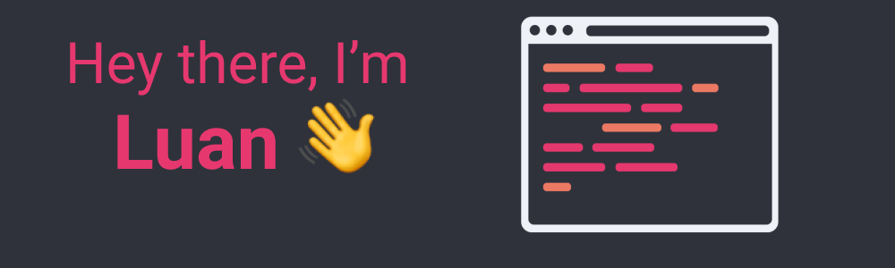

<h1 align=center> I'm just a web developer who like to learn new technologies </h1>

# Languages
## 💻 I work with
- Front-End: HTML, CSS and JavaScript(ReactJS) 
- Back-End: NodeJS 
- Database: MongoDB

## 📚I wanna learn...
- UX/UI Design
- Elixir
- TDD(Test Driven Development)
---

<h1>  Statistics </h1>

---

<h3 align=center>💬 <i>Talk to me</i> </h1>

